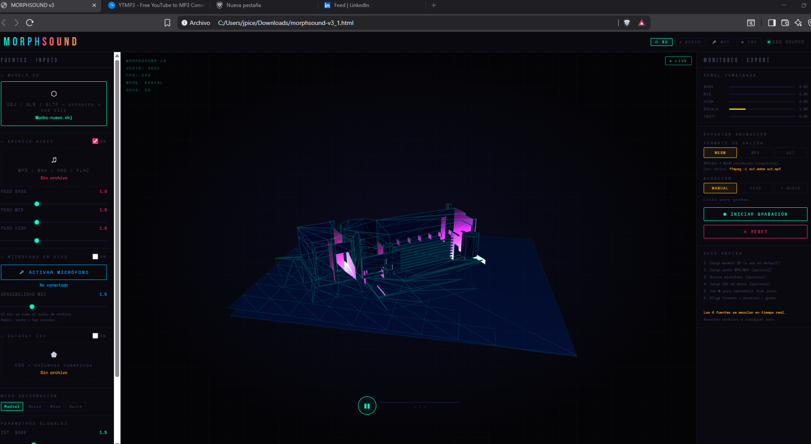

Creamos una app con claude code para poder agregar un modelo 3D en obj,glb or gltf, luego un data set, un audio grabado en mp3 o hasta audio en vivo, y que genere una animación deformando el modelo con estas variables.

